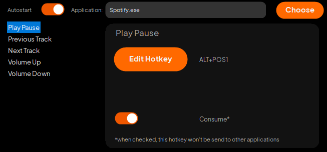
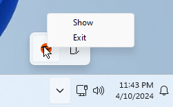

# Hotkeyfy
Hotkeyfy makes it possible to add sound control hotkeys to any process.

## Features
- Global custom Hotkeys for
    - Play-Pause
    - Previous Track
    - Next Track
    - Volume Up
    - Volume Down
- Works with any program that uses window messages to control tracks, **including Spotify**

## Installing

Just download the latest installer from the [releases section](https://github.com/Random-typ/Hotkeyfy/releases). Then follow the instructions in the installer.

## Building yourself
Download the repository from the master branch and open the solution with Visual Studio.
You may need the following components:
- Desktop development with C++
- C++/CLI support for v143 build tools

## License
This project is licensed under the MIT licence, which can be found [here](LICENSE).

